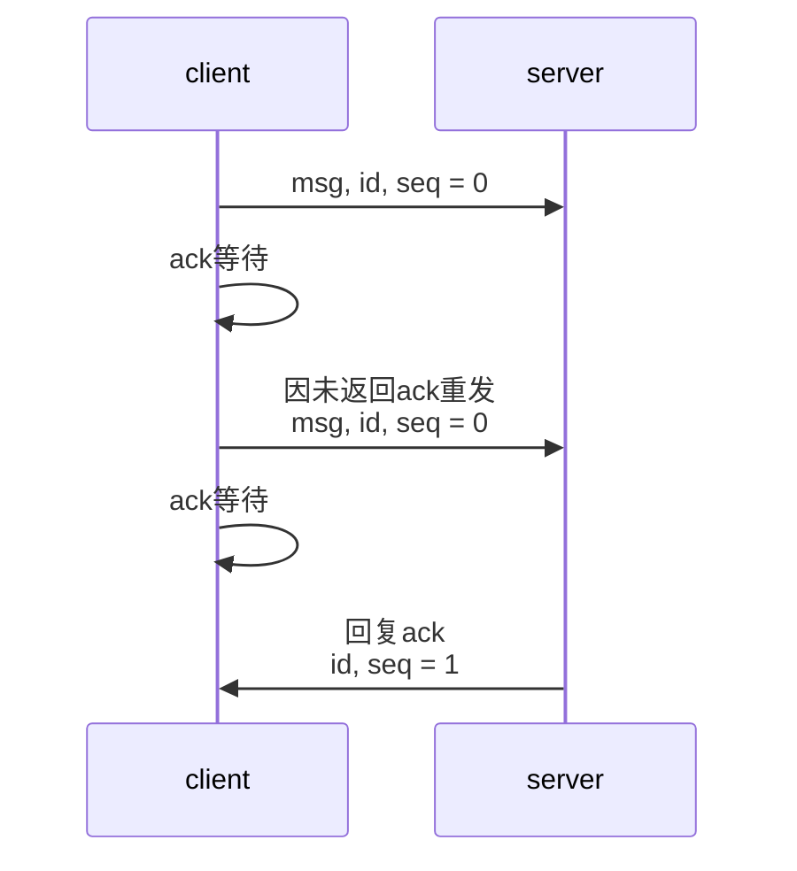
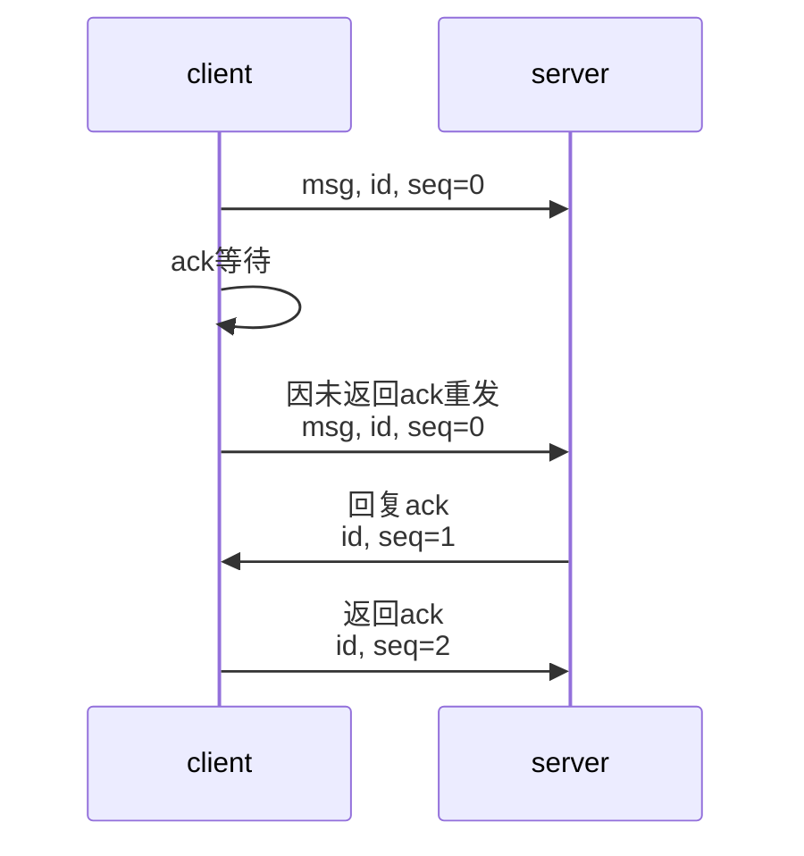
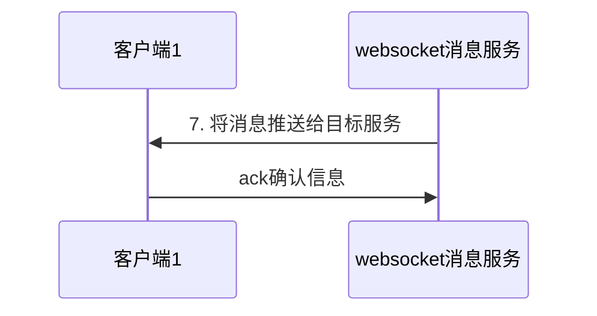
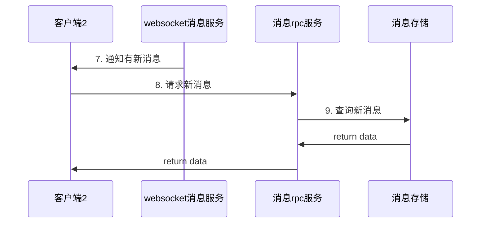

---
tags:
  - project
  - im
  - system_design
status: archived
tech_stack:
  - "[[grpc]]"
---

## 项目需求
im聊天服务，可分为三大核心业务

+ 用户业务
    - 用户登入、注册、详情、查找
+ 社交【好友、群】
    - 好友：好友添加、列表
    - 群：进群，退群，列表
+ 聊天
    - 私聊、群聊、聊天记录

## 项目架构

## 各功能实现
### 用户服务
#### 注册功能
+ 验证是否已经存在该用户（手机号）
+ 对密码加密
+ 新增用户
+ 生成token

#### 搜索，用户信息功能
+ 用户信息
+ 用户搜索 用户名（模糊查询）  手机号（精确查询） ids查询（采用in的方式查询）
+ 错误日志记录

### 社交服务
#### 好友与群业务
+ 好友/群申请
    - 好友申请
    - 好友处理
    - 好友列表
+ 好友/群申请处理
+ 好友/群成员查询
+ 创群
+ 其他业务....

### IM通讯服务 [[无标题文档]]
+ 聊天功能【核心】：群聊/私聊
+ 消息已读未读
+ 历史/在线/离线消息
+ 用户在线/离线状态

#### 路由设置
+ 获取请求信息
+ 解析请求对象
+ 根据请求对象调用处理方法 

#### 私聊实现
+ 单聊功能分析
+ 推与拉
    - 推： 服务端主动向客户端推送消息
    - 拉： 客户端自己从服务端拉取消息
+ 读扩散 vs 写扩散 
    - 读扩散
        * 只有一个会话记录
        * 读操作很重（群聊多时压力很大）
        * 客户端自己的压力大
    - 写扩散
        * 每个用户拥有自己的一个会话记录
        * 写操作压力很大（写入的时候要给每个信箱都写）
        * 服务器压力大

#### 消息可靠性
- 传输保障（tcp）
- 确认机制（类似tcp三次握手）
- 重试机制
	根据业务选择

- 消息顺序保障

#### 收发模型
- 可靠性
	- 基于ACK通讯机制
	- 基于拉取机制
本项目采取第一种

#### 为什么选择[[Kafka]]
