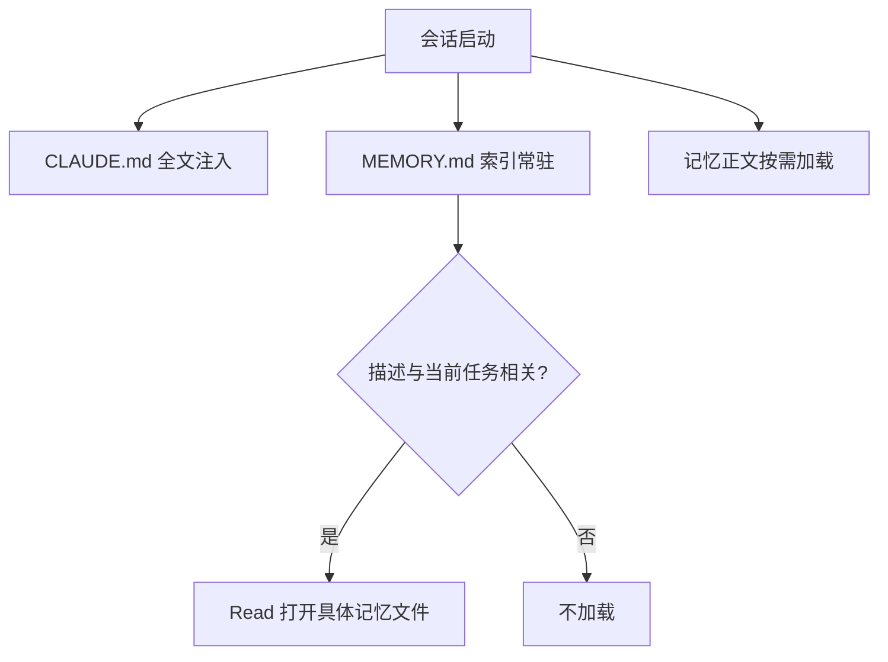
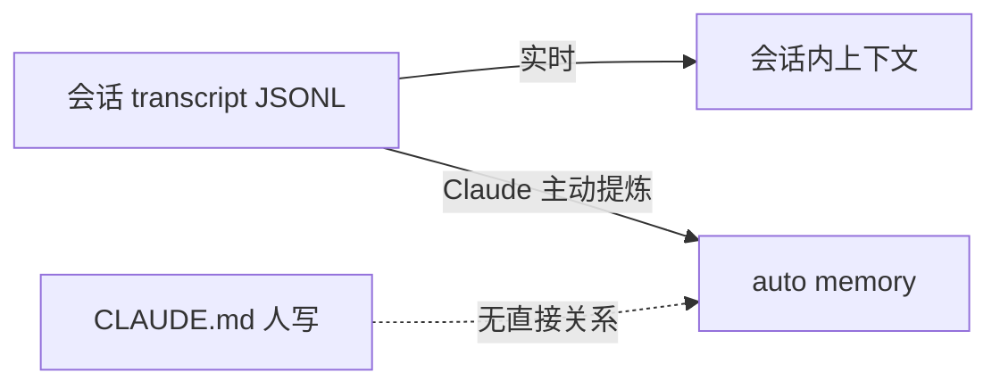

# Claude Code 记忆管理

Claude Code 的记忆是**分层**的，不同机制的维护者和生命周期不一样。全部用 **Markdown 文件**存储，没有数据库。

## 四层记忆机制

| 机制 | 谁维护 | 生命周期 | 作用 |
|------|--------|----------|------|
| **CLAUDE.md** | 人写 | 永久、随仓库走 | 项目/全局的稳定指令、约定、规范 |
| **Auto memory** | Claude 自动写 | 永久、按项目隔离 | 用户偏好、反馈、项目状态、外部引用 |
| **Session context** | 自动 | 单次会话 | 当前对话历史，`/compact` 可压缩 |
| **Plan / Tasks** | 协作完成 | 单个任务 | 执行计划和待办，做完即废 |

> [!tip] 选择法则
> - 团队共享的稳定规范 → **CLAUDE.md**（进 git）
> - 个人偏好、对话中观察到的持久信息 → **Auto memory**（不进 git）
> - 这次任务怎么干 → **Plan**
> - 这次任务有哪些待办 → **Tasks**

---

## Auto Memory 存储结构

存放路径（按项目隔离）：

```
~/.claude/projects/<项目绝对路径转 slug>/memory/
```

本 vault 对应：

```
~/.claude/projects/-Users-yllmis-note-obsidian-Obsidian-Vault/memory/
├── MEMORY.md                  # 索引，常驻上下文
└── feedback_bagu_rules.md     # 具体记忆文件，按需加载
```

### MEMORY.md 索引格式

```markdown
# Memory Index

- [Go八股学习规则](feedback_bagu_rules.md) — 每5题存档、答题点评流程、笔记格式规范
```

即：`- [标题](文件.md) — 一句话描述`

- `文件.md` 是**同目录下**的具体记忆文件（相对路径链接）
- 描述写得好坏，决定 Claude 会不会在正确时机点开该文件

### 记忆文件格式

```markdown
---
name: feedback-bagu-rules
description: Go八股问答学习流程规则——每5题自动存档、答题点评流程
metadata:
  node_type: memory
  type: feedback
  originSessionId: 5caab129-...
---

（正文：具体规则）

**Why:** 用户在准备 Go 后端面试，通过八股问答构建本地知识库。

**How to apply:** 每次八股对话时遵守此流程，答完 5 题主动存档。
```

要点：
- 文件命名：`<type>_<kebab-case-slug>.md`
- **Why**（为何记）+ **How to apply**（何时怎么用）防止未来只看到事实却不知道适用边界
- 旧记忆加载时会附带时效提醒——记忆是时点观察，不是实时真相

---

## 四种记忆类型

类型写在**每个记忆文件的 frontmatter** 里（`metadata.type`），不在 MEMORY.md 中。

| type | 存什么 | 例子 |
|------|--------|------|
| **user** | 你是谁：角色、专长、偏好 | Go 后端工程师，在学 Agent，笔记用中文 |
| **feedback** | 你对我工作方式的要求 | 每答完 5 题自动存档，不需提醒 |
| **project** | 项目目标、决策、阶段 | 目标是构建 AI 推送知识系统 |
| **reference** | 外部资源指针 | API 文档 URL、看板链接、配置位置 |

> [!note] 区分技巧
> - **feedback vs project**：feedback 是"你希望我怎么做事"（跨任务通用）；project 是"这个项目本身是什么状态"
> - **reference 不存内容，只存指针**——内容会过时，指针让你需要时取新鲜的

实际示例：

| 文件 | type | 记的是什么 |
|------|------|-----------|
| `mimo-api-reference` | reference | Mimo token plan API 调用要点 |
| `user-profile` | user | Go 后端、学 Agent、想自己写代码 |
| `project-notes` | project | code_agent 项目关键知识点 |
| `feedback_bagu_rules` | feedback | 八股问答存档流程 |

---

## 该存 / 不该存

**该存**：
- 跨会话仍有用的偏好、纠正、约定
- 稳定的个人/角色信息
- 项目的目标、已定决策、当前阶段
- 外部资源的稳定指针

**不该存**：
- 代码里已有的结构/逻辑（直接读代码更准）
- 密钥、token、密码、隐私
- 会话内临时状态（属于 plan/tasks）
- 重复 CLAUDE.md 的内容
- 未验证的猜测和推断

> [!important] 判断标准
> ==一年后还有用、且读代码/仓库拿不到，才进 auto memory==

---

## 加载机制



1. **MEMORY.md 是唯一常驻的 auto memory**——只是索引，控制上下文成本
2. **记忆正文按需加载**——靠 description 相关性触发
3. **过期提醒**：旧记忆加载时带时效警告

---

## 跨会话范围

**跨会话 = 同项目、新开会话**。

- 同一个 vault/项目目录里新开对话 → 能读到之前的记忆
- 换到别的项目目录 → 另一套 `memory/`，互不相通

---

## CLAUDE.md vs Auto Memory vs Plan vs Tasks

| 维度 | CLAUDE.md | Auto memory | Plan | Tasks |
|------|-----------|-------------|------|-------|
| 谁写 | 人 | Claude 自动 | Claude 提出、你确认 | 协作 |
| 存哪 | 仓库（进 git） | `~/.claude/.../memory/` | 会话内 | 会话内 |
| 生命周期 | 永久，手动编辑 | 永久，自动增删改 | 任务结束即废 | 完成即删 |
| 作用域 | 全局/项目/子目录，团队共享 | 按用户、按项目隔离 | 单个任务 | 单任务待办 |

---

## 主动管理记忆

**要求记住**：
- 直接说："记住：以后 Go 外部调用一律包 `context.WithTimeout`"
- 指定位置："把这条记到 CLAUDE.md 里" / "作为 feedback 记忆保存"
- 用 `/memory` 命令打开记忆文件编辑

**要求忘掉**：
- 说："忘掉 X" / "以后不要再 Y"
- 指定文件："把 `feedback_bagu_rules.md` 里第 3 条删掉"
- 手动删文件后，记得同步更新 MEMORY.md 索引

**验证**：说完"记住"后要求"把你刚记的内容读给我看"

---

## 会话记忆（Session / Transcript）

长期记忆（auto memory）之外的另一套机制：**完整对话的本地持久化**，用于 resume。

> [!tip] 两套机制分工
> - **Transcript**：录音带——完整对话原话，可 resume，30 天清理
> - **Auto memory**：笔记——提炼过的、长期的、跨会话的

### 存储位置

```
~/.claude/projects/<项目 slug>/<session-id>.jsonl
```

- **JSONL**：每行一条消息 / 工具调用 / 元数据，**边聊边写**
- 会话绑定项目目录（slug 规则与 memory 相同）
- `~/.claude/history.jsonl`：输入历史（prompt 历史）
- 与 `memory/` 目录并列，互不混用

### 恢复会话

| 命令 | 作用 |
|------|------|
| `claude --continue` / `-c` | 打开当前目录**最近一次**会话 |
| `claude --resume` / `-r` | 打开**会话选择器** |
| `claude --resume <名字/ID/路径>` | 直接恢复指定会话 |
| `claude --from-pr <编号>` | 按 PR 过滤相关会话 |
| `/resume` | 会话内切换到另一个会话 |
| `/branch` | 分叉出新会话，原会话不动 |

选择器快捷键：`Space` 预览、`Ctrl+R` 重命名、`Ctrl+A` 所有项目、`Ctrl+W` 所有 worktree。

**恢复带回**：完整历史（含工具调用/结果）、模型、agent、权限模式、活跃 goal、未过期定时任务。  
**不带回**：`--mcp-config`、`--add-dir` 等启动参数需重新传。

### /compact 与自动压缩

上下文快满时**自动 compact**（也可手动 `/compact [重点]`）：

- 历史**压缩成结构化摘要**，不是删 transcript
- **原始 JSONL 仍在磁盘**，`/resume` 仍能回完整版

| 压缩后保留 | 处理 |
|------------|------|
| System prompt、CLAUDE.md、auto memory | 从磁盘重新注入 |
| Plan | 重新注入 |
| 最近读/改的文件 | 最多重读 5 个 |
| 用过的 skill 正文 | 重注入，单个 5k / 总 25k token 上限 |
| 后台 subagent / 命令 | 继续跑，提醒别重复启动 |
| 路径规则、子目录 CLAUDE.md | 再读到匹配文件时重新加载 |
| 对话中间细节 | 被摘要替代（丢失） |

> [!note] 相关命令
> `/compact 重点保留 auth 修复` 指定摘要重点；`/clear` 换任务时清空上下文（之后仍可 `/resume`）；`/context` 看实时占用。

### 长会话恢复弹窗

Pro/Max 下，闲置 **>1 小时** 且 **>100k tokens** 再 resume 时弹窗：

1. **Resume from summary** — 立即 compact，省 token，丢细节
2. **Resume full session as-is** — 全量加载，细节全在，每次请求更贵
3. **Don't ask me again** — 记住选择

### 会话 ↔ 长期记忆



- Transcript 是完整原话；auto memory 只在"值得跨会话记"时提炼
- 大量细节只活在 transcript 里，不进长期记忆
- 子 agent 有**独立上下文**，不继承主会话历史和 auto memory，只返回摘要

### 管理与清理

| 操作 | 方式 |
|------|------|
| 导出会话 | `/export` 或 `claude -p --resume <id> --output-format json` |
| 看上下文占用 | `/context` |
| 保留期 | 默认 **30 天**（`cleanupPeriodDays`） |
| 删项目会话 | `claude project purge` |
| 关掉 transcript 写入 | `CLAUDE_CODE_SKIP_PROMPT_HISTORY` / `--no-session-persistence` |

---

## 相关路径

- 项目指令：`/Users/yllmis/note/obsidian/Obsidian Vault/CLAUDE.md`
- 记忆索引：`~/.claude/projects/-Users-yllmis-note-obsidian-Obsidian-Vault/memory/MEMORY.md`
- 会话 transcript：`~/.claude/projects/-Users-yllmis-note-obsidian-Obsidian-Vault/<session-id>.jsonl`
- 官方文档：[Memory](https://code.claude.com/docs/en/memory) · [Sessions](https://code.claude.com/docs/en/sessions) · [Context window](https://code.claude.com/docs/en/context-window)

---

## Q&A

## Q1：Claude Code 的记忆主要用什么格式存储？

**答案**：
全部是 Markdown 文件，没有数据库或二进制格式。
- 记忆正文：`.md` + YAML frontmatter（`name` / `description` / `metadata.type`）
- 索引：`MEMORY.md`（纯 Markdown 列表）
- 项目/全局指令：`CLAUDE.md`

选 md 的原因：人可读可编辑、模型擅长直接消费、frontmatter 够存元数据、好备份好同步。代价是没有向量检索，靠索引描述做相关性匹配。

**记忆**：**全是 Markdown，frontmatter 存元数据，索引描述决定能不能被检索到**。

---

## Q2：MEMORY.md 里的 `文件.md` 指什么？四种类型存在哪里？

**答案**：
- `文件.md` 是**同目录下**的具体记忆文件，相对路径链接
- 四种类型**不在 MEMORY.md**，而是写在每个记忆文件自己的 frontmatter 里（`metadata.type`）
- MEMORY.md 只是索引（标题 + 文件名 + 一句话），不存类型和正文

**记忆**：**索引在 MEMORY.md，类型在各文件的 frontmatter，正文按需读**。

---

## Q3："跨会话"是指什么范围？

**答案**：
指**同项目、新开会话**。记忆按项目目录隔离：
- 同一 vault/项目新开对话 → 能读到之前的记忆
- 换到别的项目目录 → 另一套 `memory/`，互不相通

**记忆**：**跨会话不跨项目，记忆跟着项目目录走**。

---

## Q4：记忆能实现"每次 X 自动做 Y"吗？

**答案**：
不能。记忆只影响模型看到的上下文，不改变 harness 行为。
事件触发的自动行为（"每次提交前跑测试"）需要配 hooks 写进 `settings.json`。

**记忆**：**记忆管上下文，hooks 管自动行为，别混用**。

---

## Q5：Claude Code 如何记住之前的会话？和长期记忆什么关系？

**答案**：
两套独立机制：
1. **Transcript（会话记忆）**：`~/.claude/projects/<slug>/<session-id>.jsonl`，边聊边写完整对话，`claude --continue` / `--resume` / `/resume` 恢复
2. **Auto memory（长期记忆）**：Claude 主动提炼的偏好/规则，跨会话注入

关系：transcript 是原话录音带（30 天清理）；auto memory 是提炼笔记（长期）。大量细节只活在 transcript 里，不进长期记忆。

**记忆**：**transcript 存原话可 resume，auto memory 存提炼管长期**。

---

## Q6：/compact 之后之前的对话内容还在吗？

**答案**：
- **上下文里**：被结构化摘要替代，细节丢失
- **磁盘上**：原始 JSONL 不动，`/resume` 仍可回完整版
- 压缩后自动重注入：CLAUDE.md、auto memory、plan、最近 5 个文件、用过的 skill（5k/25k 上限）

**记忆**：**compact 只压上下文，不动 transcript；摘要丢细节可 resume 找回**。
